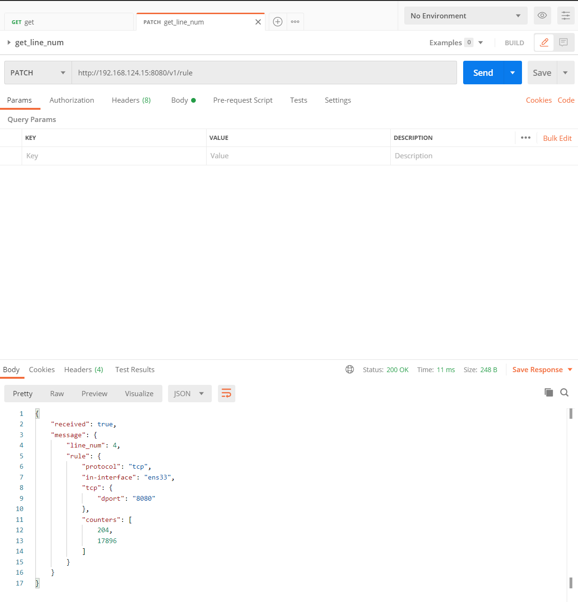
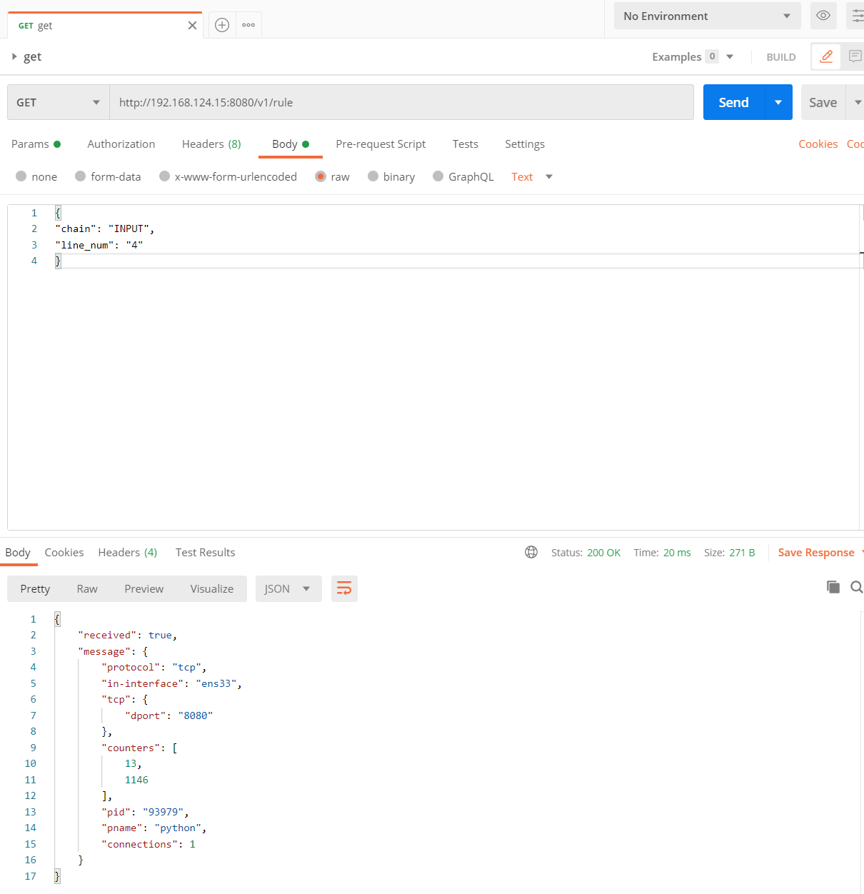

# 功能描述

## 监听器唯一标示

输入流量监听器：INPUT + 目标IP（默认0.0.0.0/0）+ protocol(默认tcp) + dport + 网卡

输出流量监听器: OUTPUT + 原始IP（默认0.0.0.0/0）+ protocol(默认tcp) + sport + 网卡

## 数据库表设计
id: primary key

name: 监听器唯一标示

create time: 创建时间

update time: 更新时间

chain: 进出链

interface: 网卡

des_ip: 目标ip

source_ip: 原始ip

des_port: 目标port

source_port: 原始port

target: 数据包行为

cmd: 执行的命令

rule_num: 在规则中的rule_num

## 获取监听器 
给定网卡和端口号，创建该端口的器，返回监听器ID，若该endpoint已经存在监听器，则直接返回ID。监听器存储端口对应的进程，连接数，记录时间戳；历史总结上传下载流量，合计，起始时间。

```
# 创建规则，监听对应网卡和端口的入站流量
iptables -A INPUT -p tcp --dport 8888 -i ens33

# 创建规则，监听对应网卡和端口的出站流量
iptables -A OUTPUT -p tcp --sport 8888 -o ens33

# 获取连接数、进程ID、进程名
netstat -anp |grep 'ESTABLISHED' |grep -i '${port}' |wc -l

# 获取端口连接详细信息
lsof -i:${port}

```

## 删除监听器

给定endpoint或者id删除规则。

```
# 根据endpoint删除规则
iptables -D OUTPUT/INPUT -p tcp --sport 8888 -o/-i ens33

# 根据ID删除规则
iptables -D INPUT/OUTPUT ${id}
```

## 获取监听器信息
给定监听器ID，获取监听器的存储的信息，添加参数x可以指定是字节还是单位制。

```
# 添加 --line-number 可以显示规则的id
iptables -nvx -L
```

## 历史数据清空功能
给定监听器ID，监听器的数据重新计时。

```
iptables -Z INPUT/OUTPUT ${id}
```

# 使用截图

## 获取规则所位于的行号



## 根据规则链和行号获取endpoint的数据




